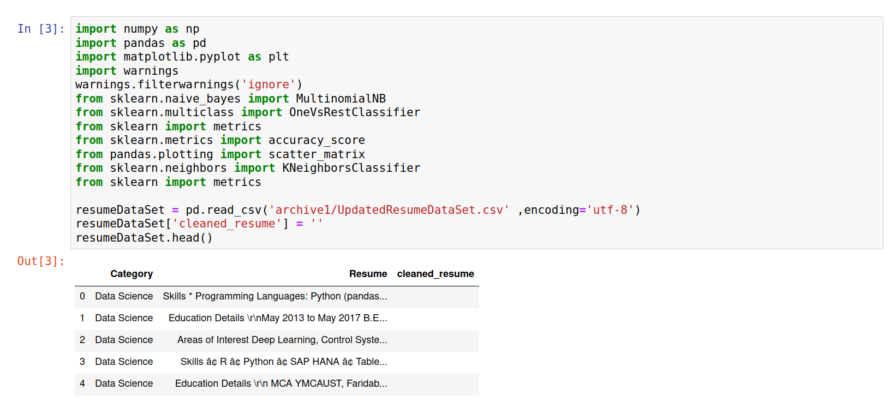
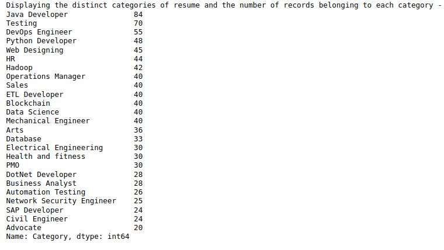
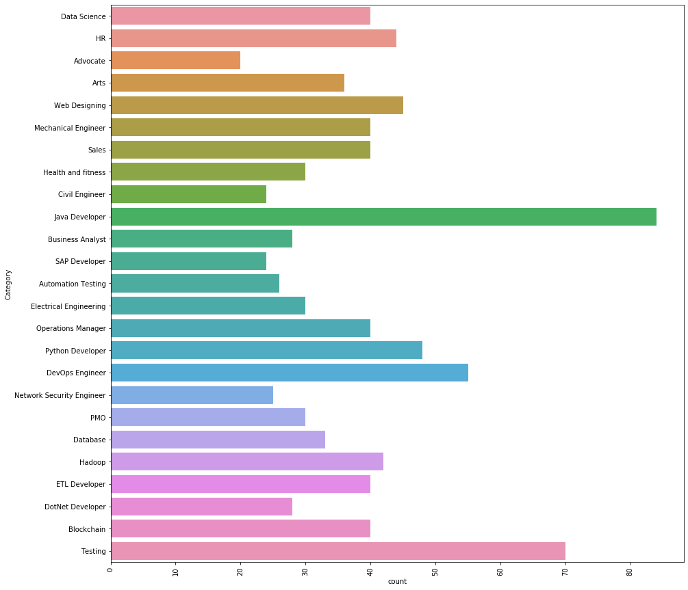
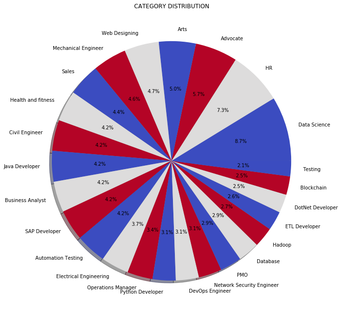
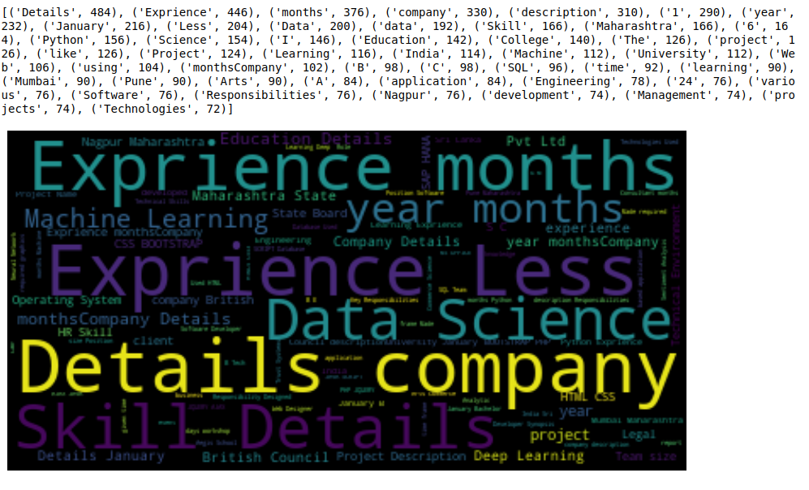
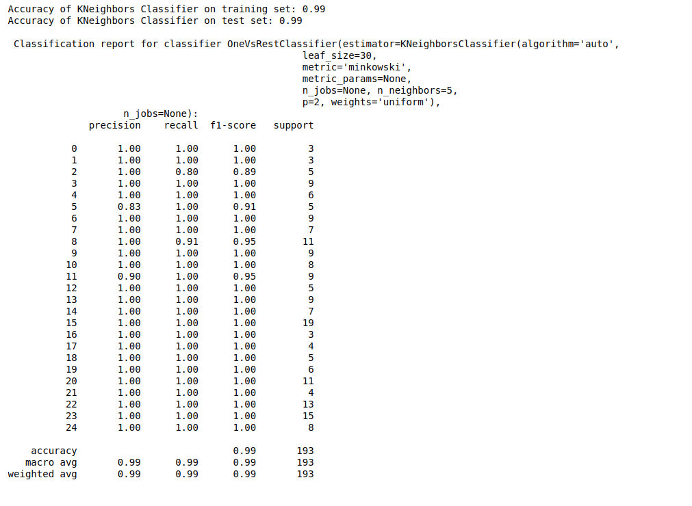

# Resume-screening-using-machine-learning
Hi!! In this project, I trained a model to screen resumes using Machine Learning

Loading the dataset-

Processing the dataset-

Displaying the distinct categories of resume and the number of records belonging to each category -

Visualization of the Data-

The result I got after training the model-

